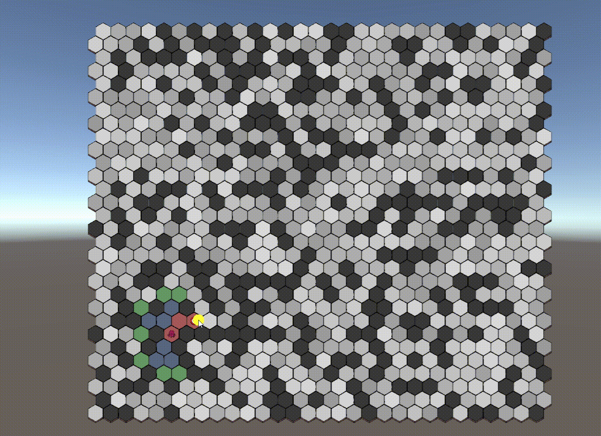

# Pathfinding
Unity简要演示寻路算法（BFS、Dijkstra、GreedyBestSearch、AStar）

- GitHub源项目：[Pathfinding - Matthew-J-Spencer](https://github.com/Matthew-J-Spencer/Pathfinding)
  - 视频演示
    - YouTube演示：[Pathfinding - Matthew-J-Spencer](https://www.youtube.com/watch?v=i0x5fj4PqP4)
    - B站演示：[Pathfinding - Matthew-J-Spencer](https://www.bilibili.com/video/BV1v44y1h7Dt/?spm_id_from=333.788.recommend_more_video.-1&vd_source=c850cfae45ee56e9a0ab838c43fc9870)

- 此项目用途：
  - 基于源作者实现的 AStar 外，还实现了 BFS、Dijkstra、GreedyBestSearch，便于更好理解AStar的演变过程


# 寻路算法

## BFS (Breadth First Search)



基本思想：每次检索 目标节点，其相邻节点全部入队待检索，直至检索到目标节点

核心代码：

```C#
public static List<NodeBase> FindPathByBFS(NodeBase startNode, NodeBase targetNode)
{
    var toSearch = new List<NodeBase>() { startNode };
    HashSet<NodeBase> processed = new HashSet<NodeBase>() { startNode };

    while (toSearch.Any())
    {
        var current = toSearch[0];

        processed.Add(current);
        toSearch.Remove(current);

        if (current == targetNode)
        {
            var currentPathTile = targetNode;
            var path = new List<NodeBase>();
            while (currentPathTile != startNode)
            {
                path.Add(currentPathTile);
                currentPathTile = currentPathTile.Connection;
            }
            return path;
        }

        var neighbors = current.Neighbors.Where(node => node.Walkable && !processed.Contains(node));
        foreach (NodeBase neighbor in neighbors)
        {
            neighbor.SetConnection(current);

            toSearch.Add(neighbor);
            processed.Add(neighbor);
        }
    }

    return null;
}
```


## Dijkstra (Uniform Cost Search)


基本思想：引入节点的 **代价 G（起点 到 此节点的代价）** 概念。每次检索一个最小 **代价 G** 的节点，将其相邻节点中 **代价 G** 较小的节点入队待检索，直至检索到目标节点

核心代码：

```c#
public static List<NodeBase> FindPathByDijkstra(NodeBase startNode, NodeBase targetNode)
{
    var toSearch = new List<NodeBase>() { startNode };
    HashSet<NodeBase> processed = new HashSet<NodeBase>() { startNode };

    while (toSearch.Any())
    {
        var current = toSearch[0];
        foreach (var t in toSearch)
            if (t.G < current.G)
                current = t;

        toSearch.Remove(current);

        if (current == targetNode)
        {
            var currentPathTile = targetNode;
            var path = new List<NodeBase>();
            while (currentPathTile != startNode)
            {
                path.Add(currentPathTile);
                currentPathTile = currentPathTile.Connection;
            }
            return path;
        }

        var neighbors = current.Neighbors.Where(node => node.Walkable);
        foreach (NodeBase neighbor in neighbors)
        {
            var costToNeighbor = current.G + current.GetDistance(neighbor);
            if (!processed.Contains(neighbor) || costToNeighbor < neighbor.G)
            {
                neighbor.SetConnection(current);
                
                neighbor.SetG(costToNeighbor);

                toSearch.Add(neighbor);
                processed.Add(neighbor);
            }
        }
    }

    return null;
}
```


## Greedy Best First Search


基本思想：舍弃 **代价 G（起点 到 此节点的代价）** 换用 **代价 H（此节点 到 目标节点的代价）**。每次检索一个最小 **代价 H** 的节点，计算其相邻节点的 **代价 H** 且入队待检索，直至检索到目标节点

核心代码：

```c#
public static List<NodeBase> FindPathByGreedyBestFirst(NodeBase startNode, NodeBase targetNode)
{
    var toSearch = new List<NodeBase>() { startNode };
    HashSet<NodeBase> processed = new HashSet<NodeBase>() { startNode };

    while (toSearch.Any())
    {
        var current = toSearch[0];
        foreach (var t in toSearch)
            if (t.H < current.H)  //The main difference with Dijkstra
                current = t;

        toSearch.Remove(current);

        if (current == targetNode)
        {
            var currentPathTile = targetNode;
            var path = new List<NodeBase>();
            while (currentPathTile != startNode)
            {
                path.Add(currentPathTile);
                currentPathTile = currentPathTile.Connection;
            }
            return path;
        }

        var neighbors = current.Neighbors.Where(node => node.Walkable);
        foreach (NodeBase neighbor in neighbors)
        {
            if (!processed.Contains(neighbor))
            {
                neighbor.SetConnection(current);
                
                //The main difference with Dijkstra
                var estimatedCostToTarget = neighbor.GetDistance(targetNode);    
                neighbor.SetH(estimatedCostToTarget);

                toSearch.Add(neighbor);
                processed.Add(neighbor);
            }
        }
    }

    return null;
}
```

## AStar


基本思想：在 **代价 G（起点 到 此节点的代价）**、**代价 H（此节点 到 目标节点的代价）** 的基础上引入 **代价 F = G + H**。每次检索一个最小 **代价 F** 的节点，计算其相邻节点的 **代价 G**、**代价 H** 且入队待检索，直至检索到目标节点

核心代码：

```C#
public static List<NodeBase> FindPath(NodeBase startNode, NodeBase targetNode)
{
    var toSearch = new List<NodeBase>() { startNode };
    var processed = new List<NodeBase>();

    while (toSearch.Any())
    {
        var current = toSearch[0];
        foreach (var t in toSearch)
            if (t.F < current.F || t.F == current.F && t.H < current.H)
                current = t;

        processed.Add(current);
        toSearch.Remove(current);

        if (current == targetNode)
        {
            var currentPathTile = targetNode;
            var path = new List<NodeBase>();

            while (currentPathTile != startNode)
            {
                path.Add(currentPathTile);
                currentPathTile = currentPathTile.Connection;
            }
            return path;
        }

        foreach (var neighbor in current.Neighbors.Where(t => t.Walkable && !processed.Contains(t)))
        {
            var inSearch = toSearch.Contains(neighbor);

            var costToNeighbor = current.G + current.GetDistance(neighbor);

            if (!inSearch || costToNeighbor < neighbor.G)
            {
                neighbor.SetG(costToNeighbor);
                neighbor.SetConnection(current);

                if (!inSearch)
                {
                    neighbor.SetH(neighbor.GetDistance(targetNode));
                    toSearch.Add(neighbor);
                }
            }
        }
    }

    return null;
}
```

# Q&A

1. 如何自行切换寻路算法？
   - 场景内切换演示算法通过修改 `GridManager._searchPathAlgorithm` 枚举即可。寻路核心算法均在 *Assets/_Scripts/Pathfinding.cs* 内
2. 如何修改演示网格？
   - 源作者提供了3种网格示例，通过修改 `GridManager._scriptableGrid` 参数即可

# 参考文章

- [Introduction to the A* Algorithm - Red Blob Games](https://www.redblobgames.com/pathfinding/a-star/introduction.html)
